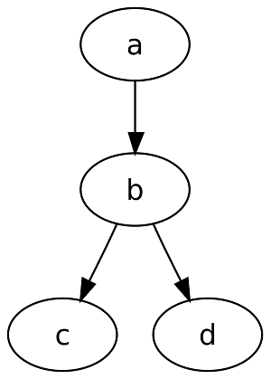

# Dot 

Граф, описанный на языке **DOT**, обычно представляет собой текстовый файл с расширением .gv или .dot в понятном для человека и обрабатывающей программы формате.

В графическом виде графы, описанные на языке DOT, представляются с помощью специальных программ, например **Graphviz**.

## Пример неориентированного графа, заданного на языке DOT

Неориентированный граф в языке DOT описывается списком вершин и рёбер, представленных названием вершин и двойным тире (--) между связанными вершинами.

```dot
graph graphname {
    a;
    b;
    c;
    d;
    a -- b;
    b -- c;
    b -- d;
}
```

Или эквивалентным образом, опустив избыточные описания:

```dot
graph graphname {
     a -- b -- c;
     b -- d;
}
```

## Пример ориентированного графа, заданного на языке DOT

Ориентированный граф в языке DOT описывается списком вершин и рёбер, представленных названием вершин и стилизованной тире и треугольной скобкой — стрелочкой (->), между связанными вершинами:

```dot
digraph graphname {
     a -> b -> c;
     b -> d;
}
```

Либо с избыточным описанием:

```dot
digraph graphname {
    a;
    b;
    c;
    d;
    a -> b;
    b -> c;
    b -> d;
}
```

